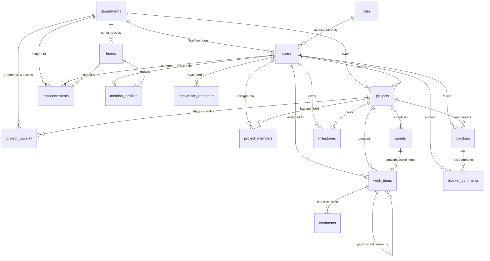
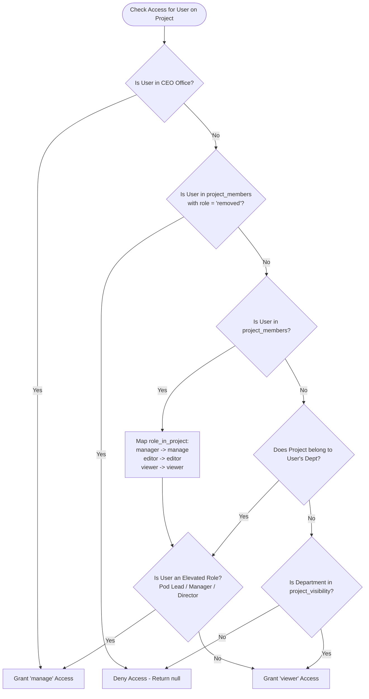

# Tech Dashboard — Complete Technical Specification & Architecture Manual

This document provides a comprehensive, exhaustive technical reference for the **Tech Dashboard** within **JCF-Central**. It details the high-level architecture, frontend/backend mechanics, all 16 database schemas, entity relationships, security & RBAC systems, API route contracts, state management, and business logic constraints.

---

## Table of Contents
1. [Executive Summary & Architectural Overview](#1-executive-summary--architectural-overview)
2. [Full Technology Stack](#2-full-technology-stack)
3. [End-to-End System Mechanics & Request Flow](#3-end-to-end-system-mechanics--request-flow)
4. [Routing & Navigation Architecture](#4-routing--navigation-architecture)
5. [Database Schemas & Data Model Reference](#5-database-schemas--data-model-reference)
   - [5.1 Organizational Core Schemas](#51-organizational-core-schemas)
   - [5.2 Agile Project Management Schemas](#52-agile-project-management-schemas)
   - [5.3 Departmental Operations Schemas](#53-departmental-operations-schemas)
6. [Entity-Relationship Diagram (ERD)](#6-entity-relationship-diagram-erd)
7. [Role-Based Access Control (RBAC) & Permissions Engine](#7-role-based-access-control-rbac--permissions-engine)
8. [Agile Domain Logic & Business Constraints](#8-agile-domain-logic--business-constraints)
9. [API Gateway & Route Contracts](#9-api-gateway--route-contracts)
10. [Frontend State Management & Query Layer](#10-frontend-state-management--query-layer)
11. [Component & Page Breakdown](#11-component--page-breakdown)

---

## 1. Executive Summary & Architectural Overview

The **Tech Dashboard** is an enterprise-grade Agile project management and departmental operations suite tailored for the Tech Division and CEO Office at Jarurat Care Foundation (JCF).

It serves two interconnected operational roles:
1. **Agile Engineering Workspace**: Jira/Linear-like issue tracking, multi-sprint planning, interactive Kanban drag-and-drop boards, Gantt timeline tracking, story-point estimation, and nested issue hierarchies.
2. **Departmental Operations Hub**: Engineering announcements, developer roster management, impediment/blocker escalations with discussion threads, delivery milestones, and intern-to-FTE conversion reminders.

```
┌──────────────────────────────────────────────────────────────────────────────────┐
│                            Frontend (React 18 + SPA)                             │
│  React Router 6 (Parent Guards) ──> Wouter (Tech Sub-routes) ──> TanStack Query │
└────────────────────────────────────────┬─────────────────────────────────────────┘
                                         │ HTTPS / Bearer JWT (Port 443)
                                         ▼
┌──────────────────────────────────────────────────────────────────────────────────┐
│                         Backend (Express API Gateway)                            │
│  /api/tech Router ──> Auth Middleware ──> Permission Engine ──> PostgREST Client │
└────────────────────────────────────────┬─────────────────────────────────────────┘
                                         │ HTTPS REST API (/rest/v1/*)
                                         ▼
┌──────────────────────────────────────────────────────────────────────────────────┐
│                      Supabase Cloud Infrastructure                               │
│  Supabase Auth (/auth/v1/user) ◄───────┴───────► PostgreSQL 15 Relational DB     │
└──────────────────────────────────────────────────────────────────────────────────┘
```

### Key Architectural Characteristics
- **Network Boundary Handling**: Hosted environments often restrict arbitrary outbound TCP ports. To ensure resilient connectivity, the backend communicates with Supabase strictly over HTTPS (port 443) using Supabase's PostgREST REST interface (`/rest/v1/*`) and Service Role keys, rather than raw PostgreSQL sockets.
- **Dual Router Pattern**: React Router 6 manages top-level authentication, department guards, and inter-department routing (`/departments/tech/*`), while an isolated `wouter` instance handles high-performance, lightweight sub-navigation within the Tech workspace (`base="/departments/tech"`).
- **Type-Safe Data Flow**: Schema definitions are normalized between Postgres snake_case and TypeScript camelCase via dedicated transformers (`toCamel`, `toSnake`), validated end-to-end with Zod runtime schemas.

---

## 2. Full Technology Stack

| Layer | Technologies | Purpose / Rationale |
| :--- | :--- | :--- |
| **Frontend Framework** | React 18, TypeScript, Vite | Fast client-side rendering with strict typing |
| **Primary Routing** | React Router 6 | Global application routing, `ProtectedRoute`, `DepartmentGuard` |
| **Sub-Routing** | Wouter 3 | Sub-path routing within `/departments/tech/*` |
| **State & Caching** | TanStack React Query v5 | Server state caching, optimistic UI updates, background refetching |
| **UI Components** | Radix UI primitives, TailwindCSS 3, Lucide Icons | Accessible, high-contrast, modern interface design |
| **Drag & Drop** | `@hello-pangea/dnd` | Seamless Kanban board and backlog item dragging |
| **Date & Timeline** | `date-fns` | Gantt chart computations, date differences, locale formatting |
| **Backend Framework** | Express 4, Node.js, TypeScript | API routing, authorization middleware, input sanitization |
| **Validation** | Zod | Runtime schema validation for request params and payloads |
| **Database & Auth** | Supabase (PostgreSQL 15 + GoTrue Auth) | User identity management, relational database storage |
| **Data Access Client** | Custom HTTPS PostgREST Client (`sbSelect`, `sbInsert`, `sbUpdate`, `sbDelete`) | Replit/Cloud-compliant HTTPS data transport |

---

## 3. End-to-End System Mechanics & Request Flow

Every interaction within the Tech Dashboard follows a strictly guarded lifecycle:

1. **Authentication Handshake**:
   - The user authenticates against Supabase Auth (`supabase.auth.signInWithPassword`).
   - An `access_token` (JWT) is stored in the client session.
   - The frontend API client attaches this token in the `Authorization: Bearer <token>` header on all requests to `/api/tech/*`.

2. **Backend Authentication & Auto-Provisioning (`requireUser`)**:
   - The Express middleware reads the Bearer token and verifies it against `GET ${SUPABASE_URL}/auth/v1/user`.
   - If verified, the server queries the `users` table for the matching UUID.
   - If the user exists in Supabase Auth but lacks a row in `users`, the middleware automatically provisions an active user profile row with their email and name.

3. **Department Authorization Guard (`requireTechOrCeo`)**:
   - The middleware verifies if the user belongs to `tech` or `ceo_office` (by resolving the user's `dept_id` against the `departments` table).
   - If the user belongs to another department, a `403 Forbidden` response is returned immediately.

4. **Resource-Level Permission Resolution (`getProjectAccess`)**:
   - For any project-specific route (`/projects/:id/*`), the permissions engine calculates the caller's effective access level (`manage`, `editor`, `viewer`, or `null`).
   - Explicit project member roles, department ownership, and CEO Office elevation are evaluated hierarchically.

5. **Data Transformation & PostgREST Execution**:
   - Incoming camelCase JSON payloads are validated via Zod and converted to snake_case (`toSnake`).
   - The query is executed against Supabase via HTTPS REST endpoints with `Prefer: return=representation`.
   - The returned snake_case database rows are transformed back into camelCase (`toCamel`) before returning to the React client.

---

## 4. Routing & Navigation Architecture

The Tech Dashboard is mounted at `/departments/tech/*` in the master router and sub-divided into dedicated views:

```
client/App.tsx
  └── Route: /departments/tech/*
        └── ProtectedRoute (Session Check)
              └── DepartmentGuard (Allowed: "tech" or "ceo-office")
                    └── TechDashboard (client/departments/tech/dashboard/Dashboard.tsx)
                          └── JcfAppLayout (Sidebar + Secondary TechProjectNav)
                                └── Wouter Switch (base="/departments/tech")
                                      ├── /                     ──> OperationsDashboard
                                      ├── /my-tasks             ──> MyTasks
                                      ├── /projects             ──> ProjectsList
                                      ├── /projects/:projectId   ──> ProjectDashboard
                                      ├── /projects/:projectId/board    ──> Board (Kanban)
                                      ├── /projects/:projectId/backlog  ──> Backlog (Sprint Planning)
                                      ├── /projects/:projectId/sprints  ──> Sprints (Lifecycle)
                                      ├── /projects/:projectId/gantt    ──> Gantt (Timeline & Calendar)
                                      ├── /projects/:projectId/about    ──> About (Metadata)
                                      ├── /projects/:projectId/items/:itemId ──> ItemDetail
                                      └── *                     ──> NotFound
```

---

## 5. Database Schemas & Data Model Reference

The Tech Dashboard interacts with **16 relational tables** in PostgreSQL. Below is the complete specification of each table, its schema definition, data types, foreign keys, and architectural rationale.

---

### 5.1 Organizational Core Schemas

#### 1. `departments`
Stores organizational units across JCF Central.
- **Why it exists**: Provides tenant boundaries, department-level scoping for projects, announcements, team rosters, and access control.

| Column | Type | Constraints | Description |
| :--- | :--- | :--- | :--- |
| `id` | `UUID` | Primary Key, `DEFAULT gen_random_uuid()` | Unique department identifier |
| `slug` | `TEXT` | `UNIQUE`, `NOT NULL` | System slug (e.g. `'tech'`, `'ceo_office'`, `'hr'`) |
| `label` | `TEXT` | `NOT NULL` | Human-readable title (e.g. `'Tech Department'`) |
| `is_active` | `BOOLEAN` | `DEFAULT true` | Department status flag |

---

#### 2. `roles`
Stores organization-wide hierarchy levels.
- **Why it exists**: Drives the Role-Based Access Control (RBAC) engine. Lower `hierarchy_level` numbers denote higher organizational authority (e.g., 1 = CEO).

| Column | Type | Constraints | Description |
| :--- | :--- | :--- | :--- |
| `id` | `UUID` | Primary Key, `DEFAULT gen_random_uuid()` | Unique role identifier |
| `slug` | `TEXT` | `UNIQUE`, `NOT NULL` | Role identifier (e.g. `'ceo'`, `'director'`, `'manager'`, `'pod_lead'`, `'member'`) |
| `label` | `TEXT` | `NOT NULL` | Display name (e.g. `'Pod Lead'`) |
| `hierarchy_level` | `INTEGER` | `NOT NULL` | Numeric rank (1 = Highest, 4 = Member/Associate) |
| `is_active` | `BOOLEAN` | `DEFAULT true` | Role active flag |

---

#### 3. `users`
Stores user profile records linked to Supabase Auth.
- **Why it exists**: Bridges Supabase authentication UUIDs with JCF organizational metadata (department assignment, role rank, employment status).

| Column | Type | Constraints | Description |
| :--- | :--- | :--- | :--- |
| `id` | `UUID` | Primary Key, `REFERENCES auth.users(id)` | Identity ID matching Supabase Auth |
| `name` | `TEXT` | `NOT NULL` | Full name of the user |
| `email` | `TEXT` | `UNIQUE`, `NOT NULL` | Corporate email address |
| `dept_id` | `UUID` | `REFERENCES departments(id)`, Nullable | Assigned department |
| `role_id` | `UUID` | `REFERENCES roles(id)`, Nullable | Assigned organizational role |
| `status` | `TEXT` | `CHECK (status IN ('active', 'on_leave', 'exited'))` | Employment status |
| `performance_score` | `NUMERIC` | Nullable | Optional HR evaluation metric |
| `joined_at` | `TIMESTAMPTZ`| `DEFAULT now()` | Join date |
| `end_date` | `TIMESTAMPTZ`| Nullable | Termination or contract end date |
| `created_at` | `TIMESTAMPTZ`| `DEFAULT now()` | Record creation timestamp |

---

#### 4. `teams`
Stores sub-groups or functional pods within a department.
- **Why it exists**: Allows grouping developers by pods (e.g. Frontend Pod, Backend Pod, Core Platform).

| Column | Type | Constraints | Description |
| :--- | :--- | :--- | :--- |
| `id` | `UUID` | Primary Key, `DEFAULT gen_random_uuid()` | Unique team ID |
| `department_id` | `UUID` | `REFERENCES departments(id) ON DELETE CASCADE` | Parent department |
| `name` | `TEXT` | `NOT NULL` | Team name (e.g. `'Platform Engineering'`) |
| `created_at` | `TIMESTAMPTZ`| `DEFAULT now()` | Creation timestamp |

---

#### 5. `member_profiles`
Stores extended technical attributes for engineering staff.
- **Why it exists**: Holds developer-specific metadata such as GitHub handles, technical skills, and bio for the department roster.

| Column | Type | Constraints | Description |
| :--- | :--- | :--- | :--- |
| `id` | `UUID` | Primary Key, `DEFAULT gen_random_uuid()` | Profile ID |
| `user_id` | `UUID` | `UNIQUE`, `REFERENCES users(id) ON DELETE CASCADE` | Associated user |
| `team_id` | `UUID` | `REFERENCES teams(id) ON DELETE SET NULL` | Assigned pod |
| `bio` | `TEXT` | Nullable | Short bio |
| `github_username`| `TEXT` | Nullable | GitHub username |
| `skills` | `TEXT[]` / `JSONB` | Nullable | Tech stack / skills array |
| `created_at` | `TIMESTAMPTZ`| `DEFAULT now()` | Creation timestamp |
| `updated_at` | `TIMESTAMPTZ`| `DEFAULT now()` | Last update timestamp |

---

### 5.2 Agile Project Management Schemas

#### 6. `projects`
Stores high-level engineering projects.
- **Why it exists**: The central entity for all Agile workflows (Kanban boards, sprints, backlogs, milestones, work items).

| Column | Type | Constraints | Description |
| :--- | :--- | :--- | :--- |
| `id` | `BIGINT` / `SERIAL` | Primary Key | Numeric project ID |
| `name` | `TEXT` | `NOT NULL` | Project name (e.g. `'Patient Portal 2.0'`) |
| `key` | `TEXT` | `NOT NULL` | Short uppercase issue prefix (e.g. `'PP'`) |
| `description` | `TEXT` | Nullable | Project description and scope |
| `start_date` | `DATE` | Nullable | Scheduled start date |
| `deadline` | `DATE` | Nullable | Target completion deadline |
| `priority` | `TEXT` | `CHECK (priority IN ('critical', 'high', 'medium', 'low'))` | Project priority |
| `owner_member_id`| `UUID` | `REFERENCES users(id) ON DELETE SET NULL` | Project lead / owner |
| `status` | `TEXT` | `CHECK (status IN ('planning', 'active', 'hold', 'signed_off', 'sign_off'))` | Project lifecycle status |
| `department_id` | `UUID` | `REFERENCES departments(id) ON DELETE SET NULL` | Home department owner |
| `created_at` | `TIMESTAMPTZ`| `DEFAULT now()` | Creation timestamp |
| `updated_at` | `TIMESTAMPTZ`| `DEFAULT now()` | Last update timestamp |

---

#### 7. `project_members`
Maps users directly to projects with specific access roles.
- **Why it exists**: Provides granular per-project permission overrides. Also supports a special `'removed'` sentinel that explicitly denies access even if the user would otherwise have departmental fallback access.

| Column | Type | Constraints | Description |
| :--- | :--- | :--- | :--- |
| `id` | `UUID` | Primary Key, `DEFAULT gen_random_uuid()` | Membership row ID |
| `project_id` | `BIGINT` | `REFERENCES projects(id) ON DELETE CASCADE` | Target project |
| `user_id` | `UUID` | `REFERENCES users(id) ON DELETE CASCADE` | Target user |
| `role_in_project`| `TEXT` | `CHECK (role_in_project IN ('manager', 'editor', 'viewer', 'removed'))` | Project-level permission role |
| `joined_at` | `TIMESTAMPTZ`| `DEFAULT now()` | Date added to project |

---

#### 8. `project_visibility`
Grants read-only access to outside departments.
- **Why it exists**: Allows cross-departmental sharing (e.g., CEO Office sharing a Tech project with PR or HR).

| Column | Type | Constraints | Description |
| :--- | :--- | :--- | :--- |
| `id` | `UUID` | Primary Key, `DEFAULT gen_random_uuid()` | Visibility grant ID |
| `project_id` | `BIGINT` | `REFERENCES projects(id) ON DELETE CASCADE` | Target project |
| `department_id` | `UUID` | `REFERENCES departments(id) ON DELETE CASCADE` | Department granted view access |
| `shared_by_user_id` | `UUID` | `REFERENCES users(id)` | User who shared the project |
| `created_at` | `TIMESTAMPTZ`| `DEFAULT now()` | Creation timestamp |

---

#### 9. `sprints`
Manages timeboxed Agile development sprints.
- **Why it exists**: Scopes work items into delivery cycles, tracks sprint goals, and drives sprint lifecycle transitions (`planning` -> `active` -> `completed`).

| Column | Type | Constraints | Description |
| :--- | :--- | :--- | :--- |
| `id` | `BIGINT` / `SERIAL` | Primary Key | Sprint ID |
| `project_id` | `BIGINT` | `REFERENCES projects(id) ON DELETE CASCADE` | Associated project |
| `name` | `TEXT` | `NOT NULL` | Sprint title (e.g. `'Sprint 14'`) |
| `goal` | `TEXT` | Nullable | Sprint objective |
| `status` | `TEXT` | `CHECK (status IN ('planning', 'active', 'completed'))` | Sprint lifecycle state |
| `start_date` | `DATE` / `TIMESTAMPTZ` | Nullable | Sprint start date |
| `end_date` | `DATE` / `TIMESTAMPTZ` | Nullable | Sprint target completion date |
| `created_at` | `TIMESTAMPTZ`| `DEFAULT now()` | Creation timestamp |

---

#### 10. `work_items`
The core Agile issue tracker table.
- **Why it exists**: Stores all epics, stories, tasks, bugs, and subtasks, their estimates, priorities, workflow statuses, hierarchy links, and assignments.

| Column | Type | Constraints | Description |
| :--- | :--- | :--- | :--- |
| `id` | `BIGINT` / `SERIAL` | Primary Key | Item ID |
| `project_id` | `BIGINT` | `REFERENCES projects(id) ON DELETE CASCADE` | Parent project |
| `sprint_id` | `BIGINT` | `REFERENCES sprints(id) ON DELETE SET NULL`, Nullable | Null = in Backlog; Non-null = assigned to sprint |
| `epic_id` | `BIGINT` | `REFERENCES work_items(id) ON DELETE SET NULL`, Nullable | Epic association |
| `parent_item_id` | `BIGINT` | `REFERENCES work_items(id) ON DELETE SET NULL`, Nullable | Direct parent in strict hierarchy |
| `type` | `TEXT` | `CHECK (type IN ('epic', 'story', 'task', 'bug', 'subtask'))` | Issue type |
| `title` | `TEXT` | `NOT NULL` | Issue title |
| `description` | `TEXT` | Nullable | Detailed Markdown specifications |
| `status` | `TEXT` | `CHECK (status IN ('todo', 'in_progress', 'in_review', 'done'))` | Workflow state |
| `priority` | `TEXT` | `CHECK (priority IN ('low', 'medium', 'high', 'critical'))` | Priority rank |
| `assignee_id` | `UUID` | `REFERENCES users(id) ON DELETE SET NULL`, Nullable | Assigned engineer |
| `story_points` | `INTEGER` / `NUMERIC` | Nullable | Fibonacci complexity estimate |
| `due_date` | `DATE` / `TIMESTAMPTZ` | Nullable | Target due date |
| `item_key` | `TEXT` | `NOT NULL` | Human key (e.g. `'PP-12'`) |
| `sort_order` | `INTEGER` | `DEFAULT 0` | Ordering index on board/backlog |
| `created_at` | `TIMESTAMPTZ`| `DEFAULT now()` | Creation timestamp |
| `updated_at` | `TIMESTAMPTZ`| `DEFAULT now()` | Last modification timestamp |

---

#### 11. `comments`
Stores discussion threads on work items.
- **Why it exists**: Enables team collaboration, code review notes, and status updates directly within each work item.

| Column | Type | Constraints | Description |
| :--- | :--- | :--- | :--- |
| `id` | `BIGINT` / `SERIAL` | Primary Key | Comment ID |
| `work_item_id` | `BIGINT` | `REFERENCES work_items(id) ON DELETE CASCADE` | Associated issue |
| `content` | `TEXT` | `NOT NULL` | Comment body text |
| `author` | `TEXT` | `NOT NULL` | Author display name |
| `created_at` | `TIMESTAMPTZ`| `DEFAULT now()` | Timestamp |

---

### 5.3 Departmental Operations Schemas

#### 12. `announcements`
Stores department-wide bulletins and notices.
- **Why it exists**: Allows Pod Leads, Managers, and Directors to broadcast technical notices, infrastructure maintenance alerts, and engineering updates.

| Column | Type | Constraints | Description |
| :--- | :--- | :--- | :--- |
| `id` | `UUID` | Primary Key, `DEFAULT gen_random_uuid()` | Announcement ID |
| `title` | `TEXT` | `NOT NULL` | Notice title |
| `body` | `TEXT` | `NOT NULL` | Notice content |
| `author_member_id` | `UUID` | `REFERENCES users(id)` | Author user ID |
| `audience_scope` | `TEXT` / `UUID` | Nullable | Department ID scope or `null` for global |
| `team_id` | `UUID` | `REFERENCES teams(id) ON DELETE SET NULL`, Nullable | Target team pod scope |
| `is_published` | `BOOLEAN` | `DEFAULT true` | Publication status |
| `created_at` | `TIMESTAMPTZ`| `DEFAULT now()` | Publication timestamp |
| `updated_at` | `TIMESTAMPTZ`| `DEFAULT now()` | Last edit timestamp |

---

#### 13. `blockers`
Tracks critical engineering impediments and risks.
- **Why it exists**: Escalates blocked tasks, third-party API outages, hardware failures, or inter-departmental dependencies.

| Column | Type | Constraints | Description |
| :--- | :--- | :--- | :--- |
| `id` | `UUID` | Primary Key, `DEFAULT gen_random_uuid()` | Blocker ID |
| `reference_code` | `TEXT` | `NOT NULL` | Short code (e.g. `'BLK-1724567890'`) |
| `project_id` | `BIGINT` | `REFERENCES projects(id) ON DELETE CASCADE` | Affected project |
| `severity` | `TEXT` | `CHECK (severity IN ('critical', 'high', 'medium', 'low'))` | Impact severity |
| `description` | `TEXT` | `NOT NULL` | Blocker description |
| `raised_by` | `UUID` | `REFERENCES users(id)` | User who reported blocker |
| `status` | `TEXT` | `CHECK (status IN ('open', 'in_progress', 'resolved', 'closed'))` | Blocker resolution state |
| `raised_at` | `TIMESTAMPTZ`| `DEFAULT now()` | Reported timestamp |
| `resolved_at` | `TIMESTAMPTZ`| Nullable | Resolution timestamp |

---

#### 14. `blocker_comments`
Stores threaded discussions regarding a specific blocker.
- **Why it exists**: Allows engineers and leads to discuss unblocking strategies, post updates, and document resolution steps.

| Column | Type | Constraints | Description |
| :--- | :--- | :--- | :--- |
| `id` | `UUID` | Primary Key, `DEFAULT gen_random_uuid()` | Comment ID |
| `blocker_id` | `UUID` | `REFERENCES blockers(id) ON DELETE CASCADE` | Associated blocker |
| `author_id` | `UUID` | `REFERENCES users(id)` | Comment author |
| `comment` | `TEXT` | `NOT NULL` | Comment message |
| `created_at` | `TIMESTAMPTZ`| `DEFAULT now()` | Timestamp |

---

#### 15. `milestones`
Tracks critical release targets and high-level milestones.
- **Why it exists**: Connects daily Agile execution with high-level organizational release schedules and client commitments.

| Column | Type | Constraints | Description |
| :--- | :--- | :--- | :--- |
| `id` | `UUID` | Primary Key, `DEFAULT gen_random_uuid()` | Milestone ID |
| `project_id` | `BIGINT` | `REFERENCES projects(id) ON DELETE CASCADE` | Associated project |
| `title` | `TEXT` | `NOT NULL` | Milestone name (e.g. `'Beta Launch'`) |
| `milestone_date` | `DATE` | `NOT NULL` | Target date (`YYYY-MM-DD`) |
| `description` | `TEXT` | Nullable | Scope description |
| `status` | `TEXT` | `CHECK (status IN ('planned', 'achieved', 'delayed'))` | Milestone state |
| `owner_member_id`| `UUID` | `REFERENCES users(id) ON DELETE SET NULL` | Lead responsible |
| `created_at` | `TIMESTAMPTZ`| `DEFAULT now()` | Timestamp |

---

#### 16. `conversion_reminders`
Automated talent conversion and performance review tracking.
- **Why it exists**: Alerts leadership when interns or probationary hires reach evaluation windows for transition to full-time engineering roles.

| Column | Type | Constraints | Description |
| :--- | :--- | :--- | :--- |
| `id` | `UUID` | Primary Key, `DEFAULT gen_random_uuid()` | Reminder ID |
| `member_id` | `UUID` | `REFERENCES users(id) ON DELETE CASCADE` | Candidate user under review |
| `reminder_type` | `TEXT` | `NOT NULL` | Review type (e.g. `'intern_conversion'`, `'probation_review'`) |
| `due_date` | `DATE` | `NOT NULL` | Review deadline (`YYYY-MM-DD`) |
| `recipient_member_id` | `UUID` | `REFERENCES users(id) ON DELETE SET NULL`, Nullable | Manager receiving alert |
| `status` | `TEXT` | `CHECK (status IN ('pending', 'completed', 'cancelled'))` | Reminder status |
| `created_at` | `TIMESTAMPTZ`| `DEFAULT now()` | Timestamp |

---

## 6. Entity-Relationship Diagram (ERD)

The following Mermaid diagram visualizes the relational connections, foreign keys, and structural cardinality across the entire database:



---

## 7. Role-Based Access Control (RBAC) & Permissions Engine

The Tech Dashboard implements a multi-tiered permission engine governed by `server/routes/tech/lib/permissions.ts` and `server/routes/tech/middlewares/auth.ts`.

### 7.1 Access Level Hierarchy
Every user-project relationship resolves to one of four access levels:

$$\text{manage} > \text{editor} > \text{viewer} > \text{null (no access)}$$

- **`manage`**: Full control. Can edit project settings, add/remove members, initiate sign-off, delete projects, manage sprints, and modify all work items.
- **`editor`**: Engineering contributor. Can create, edit, reorder, and delete work items, create and start sprints, and write comments.
- **`viewer`**: Read-only access. Can inspect boards, backlogs, items, and metrics, but cannot mutate state.
- **`null`**: Total isolation. Project does not appear in lists; API queries return `404 Not Found`.

---

### 7.2 Access Resolution Algorithm
When evaluating `getProjectAccess(user, projectId)`:



### 7.3 Removal Sentinel Pattern
To prevent security leaks, when a user is removed from a project, the backend does not simply delete the `project_members` row. Instead, it inserts a **sentinel record** with `role_in_project = 'removed'`. This sentinel explicitly revokes all departmental fallback grants, ensuring that expelled members cannot view the project even if their department owns it.

---

## 8. Agile Domain Logic & Business Constraints

The Tech Dashboard strictly enforces industry-standard Agile methodologies and data integrity rules:

### 8.1 Strict Issue Type Hierarchy
Enforced via `PARENT_TYPE_CONSTRAINTS` (`shared/tech-constants.ts`):

$$\text{Epic} \longrightarrow \text{Story} \longrightarrow \text{Task} \longrightarrow \text{Subtask}$$

| Child Type | Mandatory Parent Type | Parent Required? | Notes |
| :--- | :--- | :--- | :--- |
| **`epic`** | `null` | No | Top-level initiative |
| **`story`** | `epic` | Optional | User feature; can be attached to an Epic |
| **`task`** | `story` | Optional | Technical unit of work |
| **`bug`** | `null` | No | Defect; can exist independently at any level |
| **`subtask`**| `task` | **YES (Mandatory)** | Atomic sub-task; must link to a parent Task |

### 8.2 Assignee Integrity Rule
- A work item can only be assigned to a user who is an active member of that project (`project_members`).
- *Open-Assignment Exception*: If a project has no members registered in `project_members` yet, open assignment is permitted to prevent deadlocks on newly created projects.

### 8.3 Project Sign-off & Immutability Freeze
- When a project transitions to `signed_off` / `sign_off`, the project enters a read-only archive state.
- Subsequent `PATCH` or member addition requests are rejected with `409 Conflict ("Project is signed off and can no longer be edited")`.

### 8.4 Date Range Validation
- Projects, sprints, and milestones enforce that `deadline >= startDate`. Attempts to submit inverted date ranges trigger `400 Bad Request`.

### 8.5 Sprint Completion & Item Rollover
- Completing a sprint (`POST /sprints/:id/complete`) triggers an incomplete-item disposition modal:
  - Incomplete items can be moved to the **Product Backlog** (`sprint_id = null`), or
  - Rolled over into the **Next Active / Planning Sprint** (`sprint_id = nextSprintId`).

---

## 9. API Gateway & Route Contracts

All Tech API endpoints are mounted under `/api/tech` and require authentication.

### 9.1 Projects API
| Method | Path | Required Access | Description |
| :--- | :--- | :--- | :--- |
| `GET` | `/projects` | Authenticated | List all projects visible to caller |
| `POST` | `/projects` | Pod Lead+ / CEO | Create a new project |
| `GET` | `/projects/:id` | Viewer+ | Get project details and computed `accessLevel` |
| `PATCH` | `/projects/:id` | Manage | Update project attributes |
| `DELETE` | `/projects/:id` | Manage | Delete project and cascade child items |
| `POST` | `/projects/:id/sign-off` | Manage | Finalize and lock project |
| `GET` | `/projects/:id/summary` | Viewer+ | Aggregate issue metrics (by status, by type) |

### 9.2 Sprints API
| Method | Path | Required Access | Description |
| :--- | :--- | :--- | :--- |
| `GET` | `/projects/:projectId/sprints` | Viewer+ | List all sprints for a project |
| `POST` | `/projects/:projectId/sprints` | Editor+ | Create a new sprint |
| `GET` | `/sprints/:id` | Viewer+ | Get single sprint |
| `PATCH` | `/sprints/:id` | Editor+ | Update sprint details |
| `DELETE` | `/sprints/:id` | Editor+ | Delete sprint |
| `POST` | `/sprints/:id/start` | Editor+ | Transition sprint to `active` |
| `POST` | `/sprints/:id/complete` | Editor+ | Transition sprint to `completed` |

### 9.3 Work Items API
| Method | Path | Required Access | Description |
| :--- | :--- | :--- | :--- |
| `GET` | `/projects/:projectId/items` | Viewer+ | List all work items in project |
| `POST` | `/projects/:projectId/items` | Editor+ | Create work item (generates key, e.g. `PP-1`) |
| `GET` | `/projects/:projectId/backlog` | Viewer+ | List backlog items (`sprint_id IS NULL`) |
| `GET` | `/items/:id` | Viewer+ | Get single work item details |
| `GET` | `/items/:id/children` | Viewer+ | Get direct child items |
| `PATCH` | `/items/:id` | Editor+ | Update item status, priority, assignee, parent |
| `DELETE` | `/items/:id` | Editor+ | Delete work item |

### 9.4 Collaboration & Project Members API
| Method | Path | Required Access | Description |
| :--- | :--- | :--- | :--- |
| `GET` | `/projects/:projectId/members` | Viewer+ | List project members |
| `POST` | `/projects/:projectId/members` | Manage | Add user to project |
| `DELETE` | `/members/:id` | Manage | Remove member (sets `'removed'` sentinel) |
| `GET` | `/items/:itemId/comments` | Viewer+ | List comments for an item |
| `POST` | `/items/:itemId/comments` | Editor+ | Add comment to item |
| `DELETE` | `/comments/:id` | Editor+ | Delete comment |

### 9.5 Operations API
| Method | Path | Required Access | Description |
| :--- | :--- | :--- | :--- |
| `GET` | `/announcements` | Tech / CEO | List departmental announcements |
| `POST` | `/announcements` | Pod Lead+ / CEO | Publish announcement |
| `PATCH` | `/announcements/:id` | Pod Lead+ / CEO | Edit announcement |
| `DELETE` | `/announcements/:id` | Pod Lead+ / CEO | Delete announcement |
| `GET` | `/blockers` | Tech / CEO | List project blockers |
| `POST` | `/blockers` | Manage on Project | Raise new blocker |
| `PATCH` | `/blockers/:id` | Manage on Project | Update blocker status / severity |
| `DELETE` | `/blockers/:id` | Manage on Project | Delete blocker |
| `GET` | `/milestones` | Tech / CEO | List project milestones |
| `POST` | `/milestones` | Manage on Project | Create milestone |
| `PATCH` | `/milestones/:id` | Manage on Project | Update milestone |
| `DELETE` | `/milestones/:id` | Manage on Project | Delete milestone |
| `GET` | `/conversion-reminders` | Tech / CEO | List intern/probation reminders |
| `POST` | `/conversion-reminders` | Pod Lead+ / CEO | Create conversion reminder |
| `GET` | `/member-profiles` | Tech / CEO | List engineering member profiles |
| `GET` | `/teams` | Tech / CEO | List departmental engineering teams |

---

## 10. Frontend State Management & Query Layer

Frontend data synchronization is powered by **TanStack React Query v5** (`@tanstack/react-query`).

### 10.1 Query Key Architecture
Every domain resource uses standardized, deterministic query keys for automatic invalidation:
```typescript
// Query Key Factory Examples
getListProjectsQueryKey()              // ["/api/projects"]
getGetProjectQueryKey(projectId)       // ["/api/projects", projectId]
getListProjectItemsQueryKey(projectId) // ["/api/projects", projectId, "items"]
getListSprintsQueryKey(projectId)      // ["/api/projects", projectId, "sprints"]
getGetBacklogQueryKey(projectId)       // ["/api/projects", projectId, "backlog"]
getGetItemQueryKey(itemId)             // ["/api/items", itemId]
getListCommentsQueryKey(itemId)        // ["/api/items", itemId, "comments"]
announcementsKey                       // ["/api/announcements"]
blockersKey                            // ["/api/blockers"]
milestonesKey                          // ["/api/milestones"]
```

### 10.2 Cache Invalidation Flow
When a user updates an item status on the Kanban board:
1. `useUpdateItem` mutation fires `PATCH /api/tech/items/:id`.
2. Upon success, React Query selectively invalidates:
   - `getListProjectItemsQueryKey(projectId)` (updates board & list)
   - `getGetProjectSummaryQueryKey(projectId)` (updates header metric counts)
   - `getGetBacklogQueryKey(projectId)` (updates backlog counters)
   - `getGetItemQueryKey(itemId)` (updates detail modal if open)
3. UI components re-render smoothly without full-page reloads.

---

## 11. Component & Page Breakdown

| Page / Component | Path | Core Features & Responsibilities |
| :--- | :--- | :--- |
| **Operations Dashboard** | `pages/operations-dashboard.tsx` | High-level metrics, announcement feed, team roster, blocker board, milestone tracking, talent conversion reminders. |
| **Projects List** | `pages/projects.tsx` | Grid and table views of active/signed-off projects, search filters, new project creation modal. |
| **Project Dashboard** | `pages/project-dashboard.tsx` | Health summary cards, status distributions, issue type breakdown charts, active sprint quick-view. |
| **Kanban Board** | `pages/board.tsx` | 4-column drag-and-drop workflow (`To Do`, `In Progress`, `In Review`, `Done`), filters (my tasks, subtasks), inline item creator, sprint complete modal. |
| **Backlog** | `pages/backlog.tsx` | Sprint planning workbench, drag-and-drop between backlog and sprints, story points rollups, sprint starter. |
| **Sprint Management** | `pages/sprints.tsx` | Comprehensive sprint manager, date bounds, sprint goal editor, complete sprint disposition wizard. |
| **Gantt & Timeline** | `pages/gantt.tsx` | Interactive timeline chart, calendar month/week view toggle, sprint schedule visualization, overdue badges. |
| **Work Item Detail** | `pages/item-detail.tsx` | Full-page issue inspection, Markdown description editor, parent/child hierarchy explorer, comment thread. |
| **My Tasks** | `pages/my-tasks.tsx` | Aggregated personal task list spanning all accessible projects using parallel `useQueries`. |
| **Project Settings Modal** | `components/dialogs/project-settings-dialog.tsx` | General metadata editor, member role assignment, removal sentinels, department sharing, sign-off freeze. |
| **Project Navigation** | `components/layout/project-nav.tsx` | Sidebar secondary navigation, project switcher with real-time search, access badge indicators. |

---

## Summary Checklist for Developers

- [x] **Base API prefix**: `/api/tech`
- [x] **Auth Token**: Supabase session JWT in `Authorization: Bearer <token>`
- [x] **Case Convention**: Frontend uses `camelCase`; Backend REST/Postgres uses `snake_case`
- [x] **Agile Hierarchy**: `epic -> story -> task -> subtask` (subtasks must have a task parent)
- [x] **Permissions**: CEO Office has super-manage; Pod Leads+ have departmental manage; Members have project-level assignments
- [x] **Removal Security**: Always write `'removed'` sentinel to `project_members` to block fallback access
